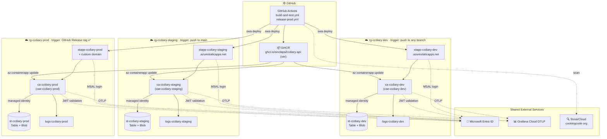
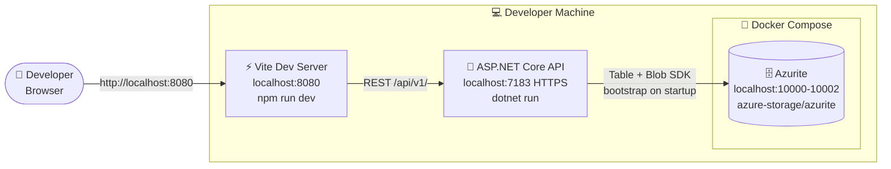

# ccDiary — Architecture

ccDiary is deployed across three isolated Azure environments (**dev**, **staging**, **prod**), each containing an identical stack of Azure resources. All environments share common external services for identity, observability, and code quality.

---

## Azure Resource Structure

The diagram below shows the Azure services deployed in each environment and how they connect. Replace `{env}` with `dev`, `staging`, or `prod`.

The Container App reaches storage with its **system-assigned managed identity**, holding no connection string: `allowSharedKeyAccess` is `false`, and the resource group template grants the identity *Storage Table Data Contributor* and *Storage Blob Data Contributor* on the account. Those are data-plane roles — the control-plane *Storage Account Contributor* grants no access to the tables or blobs themselves.

| Container | Contents | Retention |
|---|---|---|
| `images` | `{diaryId}/{diaryEntryId}` — entry images | blob soft delete, 7 days |
| `mapcache` | `tiles/{source}/{z}/{x}/{y}`, `routes/{profile}/{key}.json` | lifecycle policy deletes after 90 days |
| `content` | `entries/{diaryEntryId}.json` — spill for oversized entry JSON | blob soft delete, 7 days |

Tables: `diary`, `diaryentry`, `appuser`, `accessrequest`, `appinfo`, `geocodingcache`. They are declared in bicep *and* created at boot by `StorageBootstrapper`, so local development against Azurite works without a deployment.

---

## Multi-Environment Deployment Overview

Three independent deployments, each in its own Azure Resource Group. CI/CD deploys to dev and staging automatically; prod requires a tagged GitHub Release.

---

## Instance Details

Resource names follow the pattern `{prefix}-ccdiary-{env}`. Container App FQDNs include an Azure-generated random suffix.

| Component | Dev | Staging | Prod |
|---|---|---|---|
| **Resource Group** | `rg-ccdiary-dev` | `rg-ccdiary-staging` | `rg-ccdiary-prod` |
| **Static Web App** | `stapp-ccdiary-dev.azurestaticapps.net` | `stapp-ccdiary-staging.azurestaticapps.net` | `stapp-ccdiary-prod.azurestaticapps.net` + custom domain |
| **Container App** | `ca-ccdiary-dev.{suffix}.azurecontainerapps.io` | `ca-ccdiary-staging.{suffix}.azurecontainerapps.io` | `ca-ccdiary-prod.{suffix}.azurecontainerapps.io` |
| **Container App Env** | `cae-ccdiary-dev` | `cae-ccdiary-staging` | `cae-ccdiary-prod` |
| **Storage account** | `stccdiarydevcog5wcxyf3cz` | `stccdiarystagingn5tdd4wc` | `stccdiaryprod6vcphn6hsut` |
| **Log Analytics** | `logs-ccdiary-dev` | `logs-ccdiary-staging` | `logs-ccdiary-prod` |
| **Container Image** | `ghcr.io/sinclapa/ccdiary-api:{semver}` | `ghcr.io/sinclapa/ccdiary-api:{semver}` | `ghcr.io/sinclapa/ccdiary-api:{semver}` |
| **GitHub Environment** | `dev` | `staging` | `prod` |
| **Deploy Trigger** | Push to any non-main branch | Push / merge to `main` | GitHub Release tag `v*` |
| **Storage Auth** | Managed identity + RBAC (`allowSharedKeyAccess: false`) | Managed identity + RBAC | Managed identity + RBAC |
| **Storage SKU** | Standard_LRS · Hot | Standard_LRS · Hot | Standard_LRS · Hot |
| **CA Resources** | 0.25 vCPU · 0.5 GiB | 0.25 vCPU · 0.5 GiB | 0.25 vCPU · 0.5 GiB |
| **CA Scale** | 0–1 replicas | 0–1 replicas | 0–1 replicas |
| **OTLP Endpoint** | `otlp-gateway-prod-gb-south-1.grafana.net/otlp` | `otlp-gateway-prod-gb-south-1.grafana.net/otlp` | `otlp-gateway-prod-gb-south-1.grafana.net/otlp` |
| **API Actuator** | `https://{ca-fqdn}/actuator` | `https://{ca-fqdn}/actuator` | `https://{ca-fqdn}/actuator` |
| **Swagger UI** | `https://{ca-fqdn}/swagger` | `https://{ca-fqdn}/swagger` | `https://{ca-fqdn}/swagger` |

---

## Local Development

| Component | Value |
|---|---|
| UI | `http://localhost:8080` |
| API | `https://localhost:7183` |
| Swagger | `https://localhost:7183/swagger` |
| Azurite ports | `10000` blob · `10001` queue · `10002` table |
| Auth config | User secrets (`Entra:ClientId`, `Entra:TenantId`) |
| Storage config | `Storage:ConnectionString` in `appsettings.{Development,Local}.json` (Azurite well-known account) |
| `VITE_ENVIRONMENT` | `local` (from `.env.dev.local`) |

Azurite is not optional: it is the entire persistence tier, so `StorageBootstrapper` throws and the host never starts without it — the symptom is the API port never opening rather than a storage error. `scripts/startLocal.ps1` and `scripts/run-coverage-summary.ps1` start it; otherwise `docker compose -p ccdiary -f src/api/docker-compose.yml up -d azurite`. Compose owns the single definition, so do not start a second container by hand — it claims the same name.

Container-hosted modes (`LocalCompose`, `LocalContainer`) reach it at the `azurite` hostname rather than `127.0.0.1`, which is why they have their own `appsettings` files.
