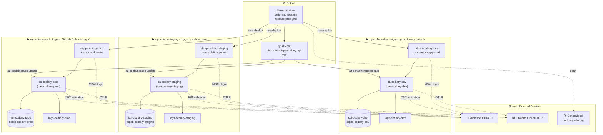
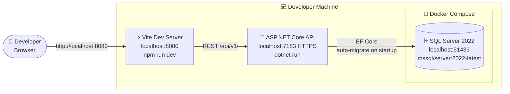

# ccDiary — Architecture

ccDiary is deployed across three isolated Azure environments (**dev**, **staging**, **prod**), each containing an identical stack of Azure resources. All environments share common external services for identity, observability, and code quality.

---

## Azure Resource Structure

The diagram below shows the Azure services deployed in each environment and how they connect. Replace `{env}` with `dev`, `staging`, or `prod`.

---

## Multi-Environment Deployment Overview

Three independent deployments, each in its own Azure Resource Group. CI/CD deploys to dev and staging automatically; prod requires a tagged GitHub Release.

---

## Instance Details

Resource names follow the pattern `{prefix}-ccdiary-{env}`. Container App FQDNs include an Azure-generated random suffix.

| Component | Dev | Staging | Prod |
|---|---|---|---|
| **Resource Group** | `rg-ccdiary-dev` | `rg-ccdiary-staging` | `rg-ccdiary-prod` |
| **Static Web App** | `stapp-ccdiary-dev.azurestaticapps.net` | `stapp-ccdiary-staging.azurestaticapps.net` | `stapp-ccdiary-prod.azurestaticapps.net` + custom domain |
| **Container App** | `ca-ccdiary-dev.{suffix}.azurecontainerapps.io` | `ca-ccdiary-staging.{suffix}.azurecontainerapps.io` | `ca-ccdiary-prod.{suffix}.azurecontainerapps.io` |
| **Container App Env** | `cae-ccdiary-dev` | `cae-ccdiary-staging` | `cae-ccdiary-prod` |
| **SQL Server FQDN** | `sql-ccdiary-dev.database.windows.net` | `sql-ccdiary-staging.database.windows.net` | `sql-ccdiary-prod.database.windows.net` |
| **SQL Database** | `sqldb-ccdiary-dev` | `sqldb-ccdiary-staging` | `sqldb-ccdiary-prod` |
| **Log Analytics** | `logs-ccdiary-dev` | `logs-ccdiary-staging` | `logs-ccdiary-prod` |
| **Container Image** | `ghcr.io/sinclapa/ccdiary-api:{semver}` | `ghcr.io/sinclapa/ccdiary-api:{semver}` | `ghcr.io/sinclapa/ccdiary-api:{semver}` |
| **GitHub Environment** | `dev` | `staging` | `prod` |
| **Deploy Trigger** | Push to any non-main branch | Push / merge to `main` | GitHub Release tag `v*` |
| **SQL Auth** | Managed Identity (Entra-only) | Managed Identity (Entra-only) | Managed Identity (Entra-only) |
| **SQL SKU** | GP_S_Gen5_1 serverless | GP_S_Gen5_1 serverless | GP_S_Gen5_1 serverless |
| **CA Resources** | 0.25 vCPU · 0.5 GiB | 0.25 vCPU · 0.5 GiB | 0.25 vCPU · 0.5 GiB |
| **CA Scale** | 0–1 replicas | 0–1 replicas | 0–1 replicas |
| **OTLP Endpoint** | `otlp-gateway-prod-gb-south-1.grafana.net/otlp` | `otlp-gateway-prod-gb-south-1.grafana.net/otlp` | `otlp-gateway-prod-gb-south-1.grafana.net/otlp` |
| **API Actuator** | `https://{ca-fqdn}/actuator` | `https://{ca-fqdn}/actuator` | `https://{ca-fqdn}/actuator` |
| **Swagger UI** | `https://{ca-fqdn}/swagger` | `https://{ca-fqdn}/swagger` | `https://{ca-fqdn}/swagger` |

---

## Local Development

| Component | Value |
|---|---|
| UI | `http://localhost:8080` |
| API | `https://localhost:7183` |
| Swagger | `https://localhost:7183/swagger` |
| SQL port | `51433` (mapped from container `1433`) |
| Auth config | User secrets (`Entra:ClientId`, `Entra:TenantId`) |
| DB password | `.env` → `SA_PASSWORD` |
| `VITE_ENVIRONMENT` | `local` (from `.env.dev.local`) |
